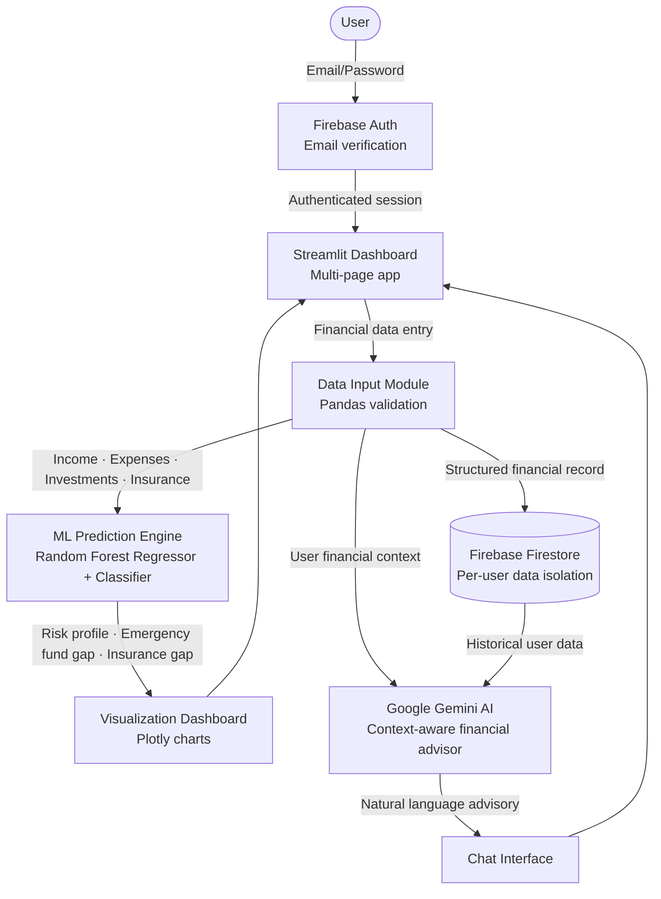

# 💰 ExplorerPM — AI-Powered Personal Finance Portfolio Manager

[](https://www.python.org/)
[](https://streamlit.io/)
[](https://firebase.google.com/)
[](https://ai.google.dev/)
[](https://scikit-learn.org/)
[](LICENSE)

**ExplorerPM** is an AI-powered personal finance intelligence platform built as part of the Practice School-II internship at **Edatapoint, New Delhi** (June–July 2025), under the "Insurance for All" mission.

The platform functions as a digital "Janam Patri" for personal finance — analyzing a user's complete financial footprint across expenses, investments, risk profile, and insurance coverage, then delivering personalized, context-aware recommendations via a Gemini AI chat interface and ML-driven prediction models. Every user gets a private, authenticated financial dashboard with real-time insights and interactive Plotly visualizations.

**Built with:** Streamlit · Google Gemini AI · Firebase Firestore + Auth · scikit-learn · Plotly · Python

---

## 📌 System Architecture



**Four-layer architecture:**
- **Authentication Layer** — Firebase Auth with email/password login, email verification on signup, and per-user session isolation
- **Data Layer** — Streamlit forms for structured financial input, validated with pandas, persisted per user in Firebase Firestore
- **Intelligence Layer** — Google Gemini AI for conversational financial advisory; Random Forest models for risk profiling and investment prediction
- **Presentation Layer** — Multi-page Streamlit dashboard with Plotly interactive charts, financial health score, and AI insight cards

---

## ✨ Core Features

**Secure User Authentication**
Firebase Auth handles signup, login, and password reset. Email verification is sent automatically on registration. All financial data is scoped per authenticated user — no cross-user data access.

**AI-Powered Financial Advisor**
Gemini AI is integrated with user financial context to answer natural language queries like "Do I have enough emergency funds?" or "How much insurance do I need?" The chat interface maintains context from the user's actual Firestore data, not just generic advice.

**ML-Driven Financial Predictions**
Two supervised models trained on simulated financial datasets:
- **Risk Classifier (Random Forest Classifier):** Categorizes users as Low, Medium, or High risk based on income stability, debt-to-income ratio, and liability profile
- **Investment Regressor (Random Forest Regressor):** Estimates savings growth, investment returns, and financial health across 1-year, 3-year, and 10-year horizons

**Emergency Fund Gap Analysis**
Calculates the user's required emergency cushion (3–6 months of expenses) and compares it against current savings, flagging users who are under-protected.

**Insurance Gap Detection**
Compares declared insurance coverage against liabilities and dependents to surface coverage gaps with severity indicators.

**Interactive Financial Dashboard**
Five dashboard views built with Plotly: income vs. expenses breakdown, investment allocation, risk score gauge, savings growth projections, and a financial health score with delta indicators.

**Modular Code Architecture**
Logic split into independent modules — `auth.py`, `dashboard.py`, `chat_interface.py`, `data_input.py`, `financial_models.py` — for maintainability and testability.

---

## 📈 Outcomes & Results

| Capability | Result |
|:---|:---|
| Risk profiling accuracy | Low / Medium / High classification via Random Forest Classifier |
| Emergency fund estimation | Validates 3–6 month financial cushion per user profile |
| AI advisory | Context-aware Gemini responses grounded in user's own Firestore data |
| Authentication | Firebase Auth with email verification and per-user data isolation |
| Dashboard visualizations | Income vs. expenses, investment breakdown, risk score, savings projections |
| Deployment readiness | `.env` secret management, Streamlit Cloud compatible |

**Known limitations from testing:**
- Gemini responses become generic when user financial data is sparse or incomplete
- ML models show occasional misclassification on edge-case financial profiles (caused by small initial training dataset size — flagged for future iteration)
- Risk classifier performance improves significantly with more diverse training data across income brackets

---

## 🛠️ Key Modules

### `components/auth.py`
Firebase email/password authentication with signup, login, and password reset flows. Email verification sent automatically on registration. Session state managed via Streamlit.

### `components/dashboard.py`
Main financial overview: net worth, monthly income/expense metrics, savings rate, debt-to-income ratio, emergency fund status, and financial health score. All rendered as interactive Plotly charts with delta indicators.

### `components/chat_interface.py`
Gemini AI integration with user financial context injected into the prompt. Handles domain-specific query detection for vacation planning, emergency funds, real estate, and insurance questions. Includes fallback messaging when API is unavailable.

### `components/data_input.py`
Streamlit forms for structured financial data entry: monthly income, fixed and variable expenses, insurance coverage, investment portfolios, emergency fund balance, and liabilities. Validated with pandas before Firestore write.

### `models/financial_models.py`
Random Forest Regressor and Classifier trained on simulated financial scenarios. Covers risk classification, investment return estimation, savings growth forecasting, and emergency fund gap calculation. Includes data validation and error handling for edge-case profiles.

---

## 🗂️ Project Structure

```
ExplorerPM/
├── app.py                          # Streamlit entry point, multi-page routing
├── components/
│   ├── auth.py                     # Firebase Auth: login, signup, verification
│   ├── dashboard.py                # Financial overview, Plotly charts, health score
│   ├── chat_interface.py           # Gemini AI chat with financial context
│   └── data_input.py               # Structured financial data entry forms
├── models/
│   └── financial_models.py         # Random Forest risk + investment models
├── requirements.txt                # Pinned dependencies
└── .env.example                    # Environment variable template
```

---

## 🚀 Installation

### Option 1: Local Development (Recommended)

**Step 1 — Clone the repository**
```bash
git clone https://github.com/Mukund2910/ExplorerPM.git
cd ExplorerPM
```

**Step 2 — Create and activate a virtual environment**
```bash
# Windows
python -m venv venv
venv\Scripts\activate

# macOS / Linux
python3 -m venv venv
source venv/bin/activate
```

**Step 3 — Install dependencies**
```bash
pip install -r requirements.txt
```

**Step 4 — Configure environment variables**

Create a `.env` file in the root directory:
```env
GEMINI_API_KEY=your_gemini_api_key_here

FIREBASE_API_KEY=your_firebase_api_key
FIREBASE_AUTH_DOMAIN=your_project.firebaseapp.com
FIREBASE_PROJECT_ID=your_project_id
FIREBASE_STORAGE_BUCKET=your_project.appspot.com
FIREBASE_MESSAGING_SENDER_ID=your_sender_id
FIREBASE_APP_ID=your_app_id
FIREBASE_DATABASE_URL=https://your_project.firebaseio.com
FIREBASE_SERVICE_ACCOUNT_KEY=paste_json_content_here
```

> **Gemini API key:** Go to [aistudio.google.com/apikey](https://aistudio.google.com/apikey), sign in with your Google account, and click "Create API Key". The free tier is sufficient.

> **Firebase credentials:** Go to [Firebase Console](https://console.firebase.google.com) → Project Settings → Service Accounts → Generate new private key. Paste the JSON content into `FIREBASE_SERVICE_ACCOUNT_KEY`.

**Step 5 — Configure Firebase services**

In the [Firebase Console](https://console.firebase.google.com):
- Enable **Firestore Database** (start in test mode for development)
- Enable **Email/Password Authentication** under Authentication → Sign-in method

**Step 6 — Run the application**
```bash
streamlit run app.py
```
Open your browser at **http://localhost:8501**

---

### Option 2: Streamlit Cloud Deployment

**Step 1 — Push your code to GitHub**

**Step 2 — Connect to Streamlit Cloud**
- Go to [share.streamlit.io](https://share.streamlit.io)
- Click "New app" and connect your GitHub repository
- Set `app.py` as the entry point

**Step 3 — Add secrets**
In Streamlit Cloud → App Settings → Secrets, add all variables from your `.env` file in TOML format:
```toml
GEMINI_API_KEY = "your_gemini_api_key"
FIREBASE_API_KEY = "your_firebase_api_key"
# ... rest of your Firebase config
```

**Step 4 — Deploy**
Click Deploy. The app will be live at `https://your-app-name.streamlit.app`

---

### ⚠️ Troubleshooting

| Issue | Solution |
|---|---|
| `Firebase connection failed` | Check all Firebase env variables are set correctly; verify Firestore and Auth are enabled in the console |
| `GEMINI_API_KEY not set` | Ensure `.env` file exists in root directory and the key is valid |
| `ModuleNotFoundError` | Activate virtual environment and re-run `pip install -r requirements.txt` |
| Gemini gives generic responses | Ensure user has submitted financial data first — the chat uses Firestore data for context |
| ML model misclassification | Expected on atypical financial profiles; flagged for improvement with larger training data |
| Port already in use | Run `streamlit run app.py --server.port 8502` |

---

## ⚙️ Stack

```
Python 3.9+ · Streamlit · Firebase Firestore · Firebase Auth
Google Gemini AI (google-generativeai) · scikit-learn
pandas · numpy · Plotly · python-dotenv
```

---

## 🔭 Future Scope

- Expand ML training dataset across diverse Indian income brackets to reduce edge-case misclassification
- Improve Gemini prompt engineering with structured context tags for more precise advisory responses
- Add OCR/NLP document parsing for bank statements, insurance policies, and tax returns
- Multi-language support (Hindi, Punjabi) to expand accessibility for non-English users
- Budgeting templates and auto-suggestions based on spending trends and income brackets
- Pareto-ranked insurance gap recommendations aligned with IRDA guidelines
- Offline-capable mobile interface for low-connectivity rural users

---

## 📚 References

- Streamlit. *The fastest way to build data apps.* [streamlit.io](https://streamlit.io)
- Firebase. *Firebase Documentation.* [firebase.google.com/docs](https://firebase.google.com/docs)
- Google. *Gemini AI — Google AI Studio.* [ai.google.dev](https://ai.google.dev)
- Scikit-learn. *Machine Learning in Python.* [scikit-learn.org](https://scikit-learn.org/stable/)
- Pandas. *Python Data Analysis Library.* [pandas.pydata.org](https://pandas.pydata.org)
- Plotly. *Interactive Graphing Library.* [plotly.com/python](https://plotly.com/python/)
